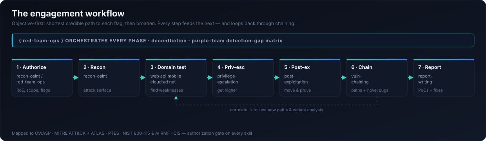
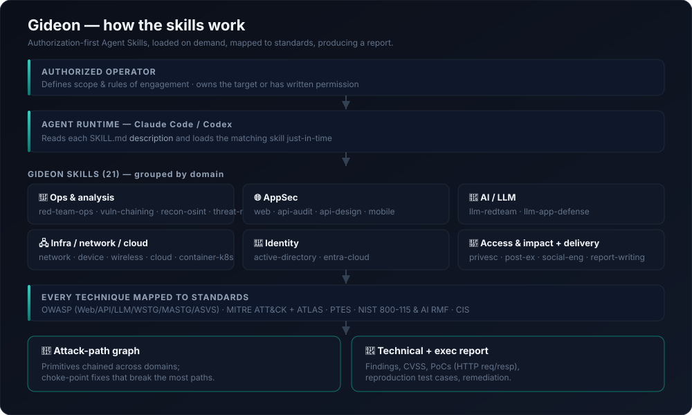
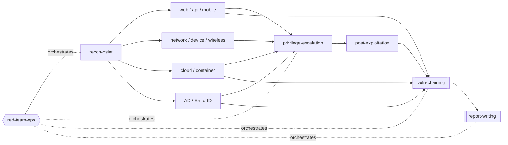
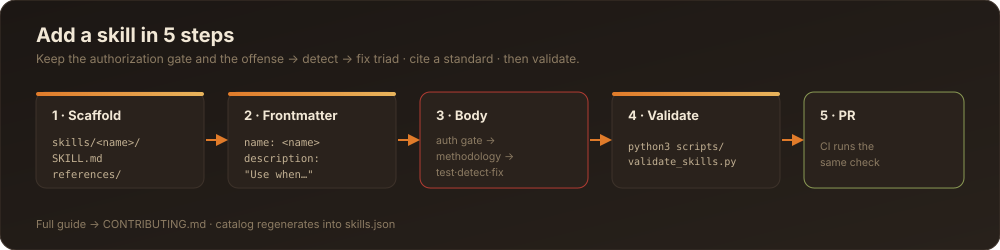

<div align="center">

# 🛡️ Gideon

### A complete offensive & defensive security skill suite for Claude Code and Codex

*"With the three hundred… I will save you." — Judges 7:7*
*A small, disciplined force — recon, precision, and clever tactics — beats a bigger enemy. That's red-teaming done right.*

[](#-the-skills)
[](LICENSE)
[](.github/workflows/validate-skills.yml)
[](#-standards-mapping)

</div>

---

<p align="center">
  
</p>

## What is this?

**Gideon** turns Claude Code (and Codex-style agents) into a rigorous, *authorized* security engineer across **every domain**: web, mobile, API, AI/LLM, network & infrastructure, network devices, wireless, Active Directory, Entra ID / cloud, and containers — plus the connective tissue that real red-teamers live in: reconnaissance, privilege escalation, post-exploitation, social engineering, the full engagement lifecycle, and **vulnerability chaining & correlation**.

Two halves of one job:

- **🔴 Offense** — attack-path-driven methodology to find what an attacker would find, *chain* small bugs into big ones, and hunt the novel/logic vulnerabilities scanners miss.
- **🔵 Defense** — secure-by-design checklists, hardening playbooks, threat models, and detection guidance so you fix the causes, not just the symptoms.

**Every skill is defensive in purpose and authorization-first.** They deliver *methodology, techniques by name, detection signals, and concrete remediation* — not drop-in weaponized exploits, mass-scanning tooling, or detection-evasion tradecraft. That's the line that keeps this useful for defenders and safe to publish.

## ✨ What makes it different

- **It chains.** The [`vuln-chaining`](skills/vuln-chaining/SKILL.md) skill combines low-severity primitives into high-impact exploit chains, reasons about attack paths **across domains** (web → cloud → identity), correlates findings to shared root causes, and hunts **novel/logic bugs** — then ranks fixes by how many paths they break.
- **It's an orchestrated suite, not 20 silos.** [`red-team-ops`](skills/red-team-ops/SKILL.md) runs the engagement lifecycle and routes each phase to the right domain skill.
- **Standards-mapped.** OWASP (Web/API/LLM/WSTG/MASTG/ASVS), MITRE ATT&CK (incl. Cloud & Containers) & ATLAS, PTES, NIST SP 800-115 & AI RMF, CIS.
- **Portable & CI-checked.** Plain Markdown + frontmatter (with a machine-readable [`skills.json`](skills.json) catalog); a zero-dependency validator and GitHub Actions keep every skill well-formed.

## 🗺️ Architecture & workflow



**System architecture**



📖 Full write-ups: **[docs/ARCHITECTURE.md](docs/ARCHITECTURE.md)** · **[docs/WORKFLOW.md](docs/WORKFLOW.md)**

## 🔗 How it fits together

`red-team-ops` runs the engagement and routes each phase to the right skill; `vuln-chaining` correlates everything into attack paths; `report-writing` presents it.



## 🧩 The skills

**🎯 Operations & analysis**
| Skill | What it does |
|-------|--------------|
| [`red-team-ops`](skills/red-team-ops/SKILL.md) | Full engagement lifecycle — RoE, threat emulation, kill chain, deconfliction, purple-team detection gaps, exec + technical reporting. Orchestrates the rest. |
| [`vuln-chaining`](skills/vuln-chaining/SKILL.md) | Exploit chaining, cross-domain attack-path graphing, correlation to root causes, and novel/logic-bug hunting. The brain of the suite. |
| [`recon-osint`](skills/recon-osint/SKILL.md) | Passive OSINT + active recon → a prioritized attack-surface inventory that feeds every domain skill. |
| [`threat-model`](skills/threat-model/SKILL.md) | STRIDE / PASTA / attack trees for web, API, and AI systems. |
| [`report-writing`](skills/report-writing/SKILL.md) | Turns findings into a landed report: finding structure, CVSS, reproduction test cases, PoCs with formatted HTTP request/response + highlighted payloads, remediation, exec + technical assembly. Black-box or gray-box. |

**🌐 Application security**
| Skill | What it does |
|-------|--------------|
| [`web-app-pentest`](skills/web-app-pentest/SKILL.md) | OWASP WSTG + Top 10 (2021): access control, injection, SSRF, auth, business logic. |
| [`api-security-audit`](skills/api-security-audit/SKILL.md) | OWASP API Top 10 (2023): BOLA, broken auth, mass assignment, SSRF — REST/GraphQL/gRPC/WS. |
| [`api-secure-design`](skills/api-secure-design/SKILL.md) | 🔵 Secure-by-design + hardening checklist (OWASP ASVS). |
| [`mobile-pentest`](skills/mobile-pentest/SKILL.md) | OWASP MASTG/MASVS for Android & iOS: storage, crypto, platform, resilience. |

**🤖 AI / LLM security**
| Skill | What it does |
|-------|--------------|
| [`llm-redteam`](skills/llm-redteam/SKILL.md) | OWASP LLM Top 10 (2025) + MITRE ATLAS: prompt injection, tool/agent abuse, RAG poisoning, plus an eval-harness. |
| [`llm-app-defense`](skills/llm-app-defense/SKILL.md) | 🔵 Defense-in-depth for LLM apps: I/O mediation, least-privilege tools, human-in-the-loop, red-team CI. |

**🖧 Infrastructure, network & cloud**
| Skill | What it does |
|-------|--------------|
| [`network-pentest`](skills/network-pentest/SKILL.md) | Internal/external network & service testing (PTES / NIST 800-115 / ATT&CK). |
| [`network-device-pentest`](skills/network-device-pentest/SKILL.md) | Routers/switches/firewalls/VPNs: management plane, firmware/CVEs, config review. |
| [`wireless-pentest`](skills/wireless-pentest/SKILL.md) | Wi-Fi WPA2/WPA3 personal & enterprise, evil-twin, segmentation. |
| [`cloud-pentest`](skills/cloud-pentest/SKILL.md) | AWS/Azure/GCP IAM privesc, exposed storage/secrets, SSRF-to-metadata (ATT&CK Cloud / CIS). |
| [`container-k8s-pentest`](skills/container-k8s-pentest/SKILL.md) | Docker/Kubernetes: escapes, RBAC, control-plane, pod→cluster→cloud escalation. |

**🪪 Identity**
| Skill | What it does |
|-------|--------------|
| [`active-directory-pentest`](skills/active-directory-pentest/SKILL.md) | On-prem AD: Kerberos, delegation, ACL/GPO abuse, DCSync, AD CS (ESC1–8), attack paths to DA. |
| [`entra-cloud-pentest`](skills/entra-cloud-pentest/SKILL.md) | Entra ID (Azure AD) & M365: spray/MFA/CA bypass, OAuth consent, Graph abuse, hybrid paths. |

**🧗 Access & impact**
| Skill | What it does |
|-------|--------------|
| [`privilege-escalation`](skills/privilege-escalation/SKILL.md) | Linux & Windows local privesc (MITRE ATT&CK). |
| [`post-exploitation`](skills/post-exploitation/SKILL.md) | Situational awareness, credential access, lateral movement, impact — prove & document. |
| [`social-engineering`](skills/social-engineering/SKILL.md) | Authorized, consented phishing/awareness assessment with employee-protection rules. |

## 🚀 Install

**Claude Code (per-user):**
```bash
git clone https://github.com/noahfranklin/gideon.git
cp -r gideon/skills/* ~/.claude/skills/
```

**Project-scoped (share with your team):**
```bash
mkdir -p .claude/skills && cp -r gideon/skills/* .claude/skills/
```

Then just ask — *"Red-team this environment,"* *"Audit this API against the OWASP API Top 10,"* or *"Chain these findings into an attack path"* — and Claude loads the matching skill from its description. **Codex / other agents:** point your skill/instruction loader at the `skills/` directory.

## 💬 Example prompts

```text
"Run a black-box red-team assessment of app.example.com — I have written authorization."
"Audit this API against the OWASP API Security Top 10 and write up the findings."
"Red-team our RAG chatbot for prompt injection and tool abuse."
"Chain these findings into an attack path and rank the fixes by paths broken."
"Test this AD environment for paths to Domain Admin (assumed breach from this host)."
"Turn my raw notes into a technical report with PoCs and reproduction test cases."
```

Claude loads the matching skill from its description, follows the authorization gate, then works the methodology.

## 📚 Example walkthroughs

End-to-end, authorized-lab examples of the skills working together (synthetic data, redacted, benign proofs):

- **[Web → Cloud chain](docs/examples/web-to-cloud-chain.md)** — SSRF → metadata creds → IAM privesc → data, and the one choke-point fix.
- **[API BOLA → account takeover](docs/examples/api-bola-account-takeover.md)** — correlating an IDOR-read with mass-assignment.
- **[LLM indirect prompt injection](docs/examples/llm-indirect-injection.md)** — canary-based testing + the architectural fix.

## 📐 Standards mapping

| Standard | Skills |
|----------|--------|
| OWASP Top 10 (2021) / WSTG | `web-app-pentest` |
| OWASP API Security Top 10 (2023) | `api-security-audit`, `api-secure-design` |
| OWASP MASTG / MASVS | `mobile-pentest` |
| OWASP Top 10 for LLM Apps (2025) / MITRE ATLAS | `llm-redteam`, `llm-app-defense` |
| OWASP ASVS | `api-secure-design` |
| MITRE ATT&CK (Enterprise/Cloud/Containers) | `network-pentest`, `active-directory-pentest`, `entra-cloud-pentest`, `cloud-pentest`, `container-k8s-pentest`, `privilege-escalation`, `post-exploitation`, `red-team-ops` |
| PTES / NIST SP 800-115 | `network-pentest`, `red-team-ops` |
| NIST AI RMF | `llm-app-defense`, `threat-model` |
| STRIDE / PASTA | `threat-model` |
| CIS Benchmarks | `network-device-pentest`, `container-k8s-pentest`, `cloud-pentest` |

## ⚖️ Use responsibly

For **authorized** work only: systems you own, or targets you have explicit written permission to test (signed engagement, bug-bounty scope, CTF, or a lab you own). See [SECURITY.md](SECURITY.md). Every skill opens with an authorization / rules-of-engagement gate.

## 🤝 Contributing




New skills, sharper checklists, fresh detections — see [CONTRIBUTING.md](CONTRIBUTING.md). Run `python3 scripts/validate_skills.py` before a PR.

## 📄 License

MIT © 2026 **noahfranklin** — see [LICENSE](LICENSE). Gideon is an **original work** created and maintained by noahfranklin (see [AUTHORS](AUTHORS) / [NOTICE](NOTICE)); references to standards and named tools are nominative only and imply no affiliation or endorsement.
