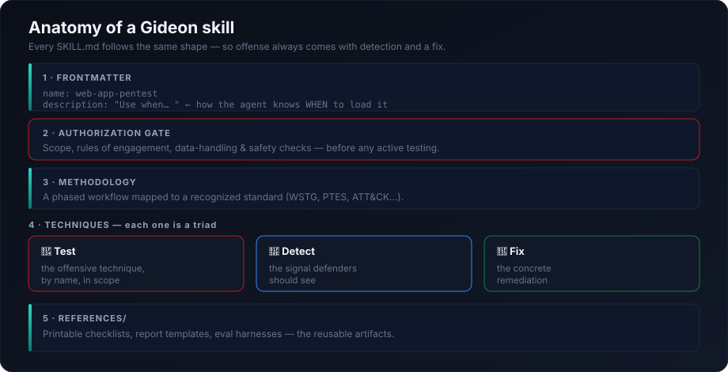

# Architecture

How Gideon is built and why it works the way it does.


## The big picture

Gideon is **not** a tool or a runtime — it's a set of instructions the agent reads. Each skill is a `SKILL.md` file. Your agent (Claude Code or a Codex-style agent) reads every skill's `description`, and when your request matches one, it loads that skill's full methodology into context and follows it. Nothing runs in the background; there's no server, no binary, no lock-in.

```
Operator (defines scope)
      │
Agent runtime (Claude Code / Codex) — matches request → loads SKILL.md
      │
Gideon skill (methodology + techniques + detection + remediation)
      │
Standards mapping (OWASP / ATT&CK / ATLAS / PTES / NIST / CIS)
      │
Outputs: attack-path graph + technical & executive report
```

## Anatomy of a skill



Every `SKILL.md` follows the same shape:

1. **Frontmatter** — `name` + a trigger-focused `description` that tells the agent *when* to load it.
2. **Authorization gate** — scope, rules of engagement, and safety checks come first, before any active testing.
3. **Methodology** — a phased workflow mapped to a recognized standard.
4. **Techniques as a triad** — every offensive technique is paired with its **detection signal** and its **remediation**. This is the core design rule: offense never ships without the fix.
5. **`references/`** — printable checklists, report templates, and eval harnesses.

## Why this design

- **Provider-neutral.** Plain Markdown + YAML frontmatter loads anywhere an agent can read instructions.
- **Composable.** Skills call each other by name (e.g., `web-app-pentest` hands APIs to `api-security-audit`, findings to `vuln-chaining`, and write-up to `report-writing`). `red-team-ops` orchestrates the whole set.
- **Standards-anchored.** Findings map to a shared vocabulary, so reports are credible and comparable.
- **Safe by construction.** The authorization gate and the offense→detection→fix triad keep the material defensive in purpose. See [SECURITY.md](../SECURITY.md).

## Skill catalog

The machine-readable catalog is [`skills.json`](../skills.json) (name, path, description, references for all 21 skills). Regenerate it after adding a skill.

## Extending Gideon

Add a folder under `skills/<name>/` with a `SKILL.md` (matching frontmatter `name`), keep the authorization gate and the offense→detect→fix triad, cite a standard, and run `python3 scripts/validate_skills.py`. See [CONTRIBUTING.md](../CONTRIBUTING.md).
