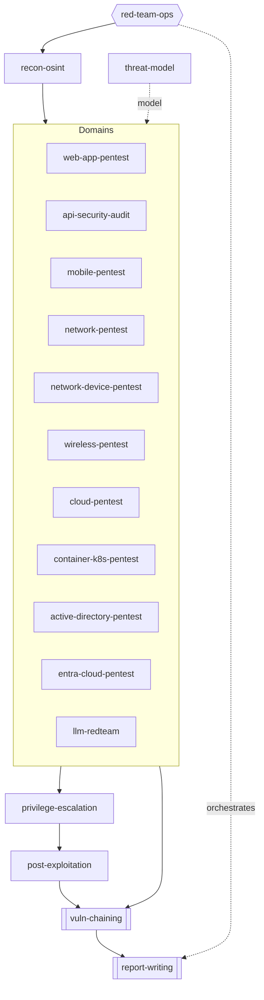

# Engagement Workflow

How the skills combine into a real, authorized engagement.

## Phases

| # | Phase | Skill(s) | Output |
|---|-------|----------|--------|
| 1 | Authorize & plan | `red-team-ops`, `threat-model` | RoE, objectives ("flags"), emulation plan |
| 2 | Recon | `recon-osint` | prioritized attack-surface inventory |
| 3 | Domain testing | `web-app-pentest`, `api-security-audit`, `mobile-pentest`, `network-pentest`, `network-device-pentest`, `wireless-pentest`, `cloud-pentest`, `container-k8s-pentest`, `active-directory-pentest`, `entra-cloud-pentest`, `llm-redteam` | findings per domain |
| 4 | Privilege escalation | `privilege-escalation` | higher access on a host |
| 5 | Post-exploitation | `post-exploitation` | lateral movement, proven impact |
| 6 | Chain & correlate | `vuln-chaining` | cross-domain attack paths, novel bugs, choke-point fixes |
| 7 | Report | `report-writing` | exec + technical report with PoCs |

`red-team-ops` runs across all phases (deconfliction, purple-team detection-gap matrix). `api-secure-design`, `llm-app-defense`, and `threat-model` are the 🔵 defensive companions used to remediate.

## Orchestration (skill-to-skill)

## The chaining loop (what makes it more than a checklist)

`vuln-chaining` reframes each finding as a **capability primitive** (info disclosure, arbitrary read/write, auth context, code exec, privilege change, trust/pivot), then:

1. **Backward-chains** from each objective to a primitive you already hold.
2. **Bridges domains** — the highest-impact chains cross boundaries (web SSRF → cloud metadata creds → IAM privesc → data; on-prem AD → hybrid sync → Entra global admin).
3. **Correlates** findings to shared root causes and compounding low-severity issues.
4. **Graphs** the environment and finds **choke-point** edges — the single fix that breaks the most paths.
5. **Hunts novel/logic bugs** scanners miss via hypothesis-driven testing and variant analysis.

The dashed feedback arrow in the diagram is this loop: each new path prompts re-testing and variant hunting.

## Black-box vs gray-box

Every skill works in both. State which you used — it changes coverage and how findings are framed (`report-writing` bakes this in).
