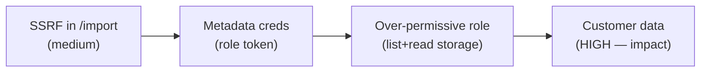

# Walkthrough: Web → Cloud chain

**Setting:** authorized lab engagement · target `acme-lab.example` (team-owned, deliberately vulnerable) · gray-box · synthetic data.
**Skills:** `recon-osint` → `web-app-pentest` → `cloud-pentest` → `vuln-chaining` → `report-writing`.
**Point:** three findings that look low/medium in isolation combine into read access to customer data — and **one** fix breaks the chain.

## The chain in one line
Image-import feature (SSRF) → cloud metadata credentials → over-permissive role → object storage read.



## Step 1 — Recon (`recon-osint`)
The attack-surface inventory flags an `/import?url=` endpoint that fetches remote images server-side. That "fetches a user-supplied URL" pattern is the SSRF hypothesis worth testing (per `api-security-audit` API7 / `web-app-pentest` A10).

## Step 2 — SSRF (`web-app-pentest`)
**Benign proof** — point the fetcher at the instance metadata service (in scope) and observe it returns internal content instead of an image:

```http
POST /import HTTP/1.1
Host: acme-lab.example
Content-Type: application/json

{"url":"http://169.254.169.254/latest/meta-data/"}   # <== PAYLOAD (internal target, authorized lab)
```
```http
HTTP/1.1 200 OK

iam/
instance-id
placement/                                            # <== EVIDENCE: internal metadata reachable
```
We stop at *proving reachability*. We do **not** exfiltrate live credentials into notes — the chain is demonstrated, then handed to `cloud-pentest` under the same authorization.

## Step 3 — Cloud impact (`cloud-pentest`)
The metadata path exposes a role token. Assessing that role's permissions (IAM analysis) shows a wildcard storage grant — it can list and read buckets far beyond the app's need. That turns "internal SSRF" into "read customer objects." Secrets are redacted throughout.

## Step 4 — Correlate (`vuln-chaining`)
Primitives:
| Finding | Primitive | Grants |
|---------|-----------|--------|
| SSRF in `/import` | trust/pivot | reach internal services |
| Metadata reachable | auth context | a role token |
| Wildcard storage role | privilege | list+read all buckets |

**Choke-point:** the highest-leverage edge is the metadata reachability. Enforcing IMDSv2 + blocking link-local egress severs the chain even if the SSRF and the broad role remain — and least-privilege on the role is the durable second fix.

## Step 5 — Report (`report-writing`)
Written up as **one HIGH finding (the chain)** plus the three contributing issues, each with the offense→detect→fix triad:

- **Detect:** egress to `169.254.169.254` from the app tier; metadata access from an app that never needed it; anomalous bucket `List/Get` from the app's role.
- **Fix (priority order):** (1) IMDSv2 + block link-local egress *[choke point]*; (2) destination allow-list on `/import`; (3) least-privilege role (drop wildcards).

**Priority table** ranks by *paths broken*, so the metadata fix sits at the top even though the SSRF is what a scanner would flag first.
